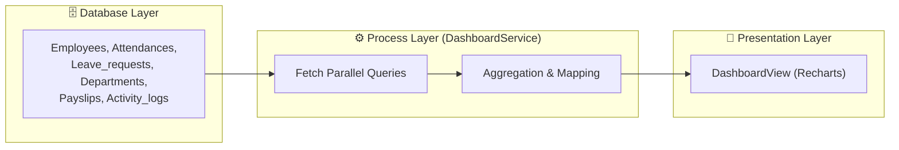

# 📊 Phân tích Chi tiết Trang Dashboard Thống kê Nhân viên (Dashboard Analytics Workflow)

Tài liệu này cung cấp cái nhìn toàn diện về luồng nghiệp vụ, kiến trúc kỹ thuật và thiết kế trải nghiệm người dùng của trang **Dashboard** trong hệ thống HRMS. Tài liệu được biên soạn để phục vụ việc bảo vệ đồ án và thuyết trình kỹ thuật.

---

## 1. Tổng quan & Mục tiêu Thiết kế

Dashboard là "bộ não" của hệ thống HRMS, nơi tổng hợp dữ liệu từ nhiều phân hệ (Nhân sự, Chấm công, Nghỉ phép, Lương, Nhật ký hệ thống).

### 🎯 Mục tiêu chính:
*   **Centralization**: Tập trung mọi thông tin quan trọng tại một màn hình duy nhất.
*   **Real-time Insights**: Cung cấp số liệu chính xác ngay tại thời điểm truy cập.
*   **Actionable Data**: Giúp Admin/Manager nhận diện nhanh các vấn đề (ví dụ: đơn nghỉ chờ duyệt, biến động quỹ lương).

### 🎭 Các Tác nhân (Actors)
1.  **Admin (Quản trị viên)**: Quyền cao nhất, giám sát toàn bộ hoạt động và chỉ số hệ thống.
2.  **Manager (Quản lý)**: Theo dõi tình hình nhân sự để điều phối công việc.
3.  **System (Hệ thống)**: Tự động tổng hợp dữ liệu từ Database mỗi khi người dùng truy cập.

---

## 2. Các Chỉ số Thống kê (Key Performance Indicators - KPIs)

Hệ thống sử dụng mô hình "At-a-glance" (nhìn sơ qua là hiểu) với 4 thẻ KPI chính:

| # | Chỉ số | Ý nghĩa Nghiệp vụ | Nguồn & Logic |
| :---: | :--- | :--- | :--- |
| 1 | **Tổng nhân viên** | Quy mô nhân sự hiện tại của tổ chức. | `employees` (Active & Probation) |
| 2 | **Hiện diện hôm nay** | Tỷ lệ đi làm thực tế trong ngày. | `attendances` (DATE = CURRENT_DATE) |
| 3 | **Đơn chờ duyệt** | Khối lượng công việc quản lý cần xử lý gấp. | `leave_requests` (STATUS = 'Pending') |
| 4 | **Phòng ban** | Cấu trúc phân cấp của công ty. | `departments` (COUNT) |

---

## 3. Phân tích Luồng Dữ liệu (Data Engineering)

Hệ thống áp dụng kiến trúc truyền tải dữ liệu từ Database lên UI thông qua các tầng xử lý sau:

### 3.1. Truy vấn Dữ liệu (Backend Logic)
Dữ liệu được lấy từ 6 bảng khác nhau trong SQL Database thông qua **Supabase Service Role**.

### 3.2. Chế độ Hoạt động gần đây (Recent Activities)
Hành động của người dùng trên hệ thống được ghi lại và hiển thị trên Dashboard theo thời gian thực (LIFO - Last In First Out).
*   **Data Structure**: { employee_id, action, entity_type, details, timestamp }
*   **Logic**: Tự động map `employee_id` với tên và ảnh đại diện để hiển thị thân thiện.

---

## 4. Kiến trúc Kỹ thuật (Technical Implementation)

Đây là phần quan trọng nhất để giải thích cho giáo viên về cách xây dựng hệ thống:

### 🚀 Tối ưu hóa Hiệu năng (Performance)
*   **Server-Side Fetching**: Dữ liệu được fetch trực tiếp tại Server Component (`/dashboard/page.tsx`), giúp giảm thiểu Client-side JavaScript và tăng tốc độ Render lần đầu (First Contentful Paint).
*   **Promise Alignment**: Các truy vấn độc lập (đếm NV, đếm đơn nghỉ...) có thể chạy song song để tiết kiệm thời gian chờ.
*   **Dynamic Rendering**: Sử dụng `force-dynamic` để đảm bảo dữ liệu luôn mới nhất, không bị trình duyệt cache cũ.

### 🎨 Thư viện & Công nghệ Sử dụng:
*   **Recharts**: Thư viện biểu đồ mạnh mẽ, hỗ trợ hiển thị dữ liệu dạng Pie và Bar trực quan.
*   **Lucide React**: Bộ icon hiện đại, nhất quán.
*   **Tailwind CSS**: Xây dựng UI Responsive, tương thích với nhiều kích thước màn hình (Mobile, Tablet, Desktop).

---

## 5. Thiết kế Trải nghiệm Người dùng (UX/UI Analysis)

Phân tích các lựa chọn thiết kế để thuyết phục về tính thẩm mỹ và tính dụng:

1.  **Phân cấp Thị giác (Visual Hierarchy)**: 
    *   Các chỉ số KPI đặt trên cùng với màu sắc biểu tượng riêng biệt (Xanh lá - An toàn, Cam - Chú ý, Đỏ - Quan trọng).
2.  **Biểu đồ Tương tác (Interactive Charts)**:
    *   **Pie Chart**: Phân bổ phòng ban giúp nhận diện nhanh bộ phận nào đang chiếm tỷ trọng lớn.
    *   **Bar Chart**: Thể hiện quỹ lương qua từng tháng, hỗ trợ so sánh thực tế (`Received`) với kế hoạch (`Pending`).
3.  **Hệ thống Avatar & Tên**:
    *   Tự động tạo Avatar từ tên (`ui-avatars.com`) nếu nhân viên chưa có ảnh, giúp giao diện luôn đầy đủ và chuyên nghiệp.

---

## 6. Luồng Xử lý Mã nguồn (Source Code Flow)

Để minh chứng cho khả năng lập trình và làm chủ mã nguồn, dưới đây là chi tiết các thành phần tham gia vào quá trình hiển thị Dashboard:

### 🛠️ Các Tệp tin (Files) Chính:
1.  **Page (Route)**: [app/(dashboard)/dashboard/page.tsx] du_an/cnkt_cnpm/app/(dashboard)/dashboard/page.tsx
    *   Đóng vai trò là Server Component, chịu trách nhiệm fetch data lần đầu giúp SEO tốt và bảo mật API Key.
2.  **Service (Business Logic)**: [server/services/dashboard-service.ts] du_an/cnkt_cnpm/server/services/dashboard-service.ts
    *   Nơi chứa hàm `getStats()`, thực hiện gom nhóm dữ liệu (Aggregation) và tính toán các chỉ số thống kê.
3.  **Repository (Data Access)**: [server/repositories/payroll-repo.ts] du_an/cnkt_cnpm/server/repositories/payroll-repo.ts
    *   Hỗ trợ Service lấy dữ liệu chuyên sâu về lương (`getYearlyStats`) từ Database.
4.  **View (UI Component)**: [components/dashboard/DashboardView.tsx] du_an/cnkt_cnpm/components/dashboard/DashboardView.tsx
    *   Client Component sử dụng thư viện **Recharts** để vẽ biểu đồ từ dữ liệu đã qua xử lý.

### 🔄 Trình tự Xử lý (Logic Flow):
*   **Bước 1**: Khi người dùng vào `/dashboard`, `page.tsx` sẽ kích hoạt hàm `dashboardService.getStats()`.
*   **Bước 2**: `dashboardService` thực hiện nhiều truy vấn `await supabase.from(...)` song song để lấy:
    *   Đếm nhân viên (lọc theo trạng thái `Active`, `Probation`).
    *   Đếm điểm danh hôm nay.
    *   Đếm đơn nghỉ phép đang `Pending`.
    *   Danh sách 4 hoạt động gần đây nhất từ bảng `activity_logs`.
*   **Bước 3**: Riêng phần lương, Service gọi sang `payrollRepo` để lấy bảng lương trong năm, sau đó dùng hàm `.reduce()` và `.filter()` trong JS để phân loại thành 'Đã chi' (Paid) và 'Dự kiến' (Chưa Paid).
*   **Bước 4**: Dữ liệu sau khi "làm sạch" được truyền vào `DashboardView` dưới dạng `props`.
*   **Bước 5**: `DashboardView` map dữ liệu vào các thẻ `statCards` và các component `<PieChart />`, `<BarChart />` để hiển thị trực quan cho người dùng.

---

## 7. Điểm nhấn dành cho Thuyết trình (Presentation Key Points)

Admin/Bạn có thể dùng các ý sau khi trình bày với giáo viên:

*   **Tính toàn vẹn Dữ liệu**: "Dashboard không chỉ đếm số, mà còn thực hiện Joining dữ liệu phức tạp giữa `employees` và `departments` để tạo ra biểu đồ phân bổ phòng ban chính xác."
*   **Tính bảo mật & Log**: "Mọi hành động quan trọng đều được Activity Service ghi lại và hiển thị ngay trên Dashboard, giúp Admin dễ dàng giám sát hệ thống mà không cần vào sâu trong database."
*   **Xử lý Ngoại lệ (Error Handling)**: "Trong code, tôi đã cài đặt cơ chế `try-catch` và fallback dữ liệu về `0` hoặc `[]` để đảm bảo Dashboard luôn hiển thị đẹp mắt ngay cả khi database chưa có dữ liệu hoặc bảng log đang khởi tạo."

---

## 8. Định hướng Phát triển (Future Improvements)

*   **Real-time Notifications**: Tích hợp WebSockets để cập nhật KPI ngay khi có người check-in mà không cần reload trang.
*   **Deep Filtering**: Cho phép lọc thống kê theo từng phòng ban cụ thể hoặc theo khoảng thời gian tùy chọn.
- **Export Report**: Thêm tính năng xuất báo cáo định dạng PDF/Excel cho các biểu đồ thống kê.

---
*Tài liệu được cập nhật ngày 28/03/2026. Phù hợp cho mục đích báo cáo chuyên môn.*
