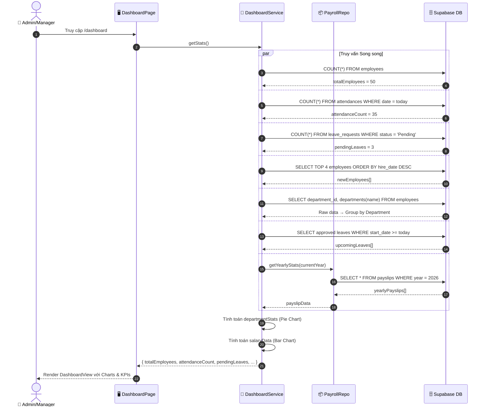
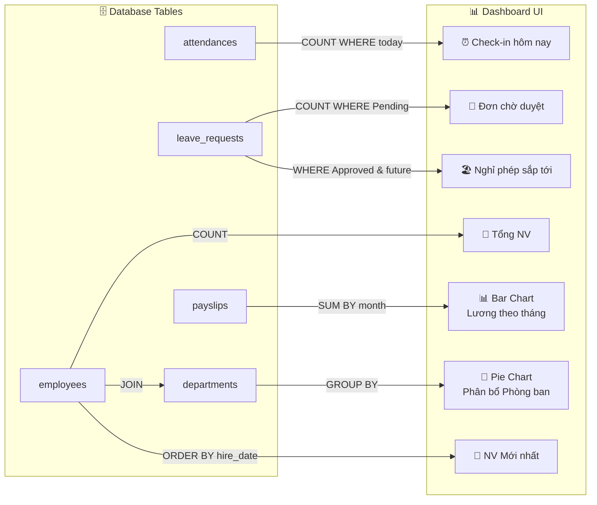
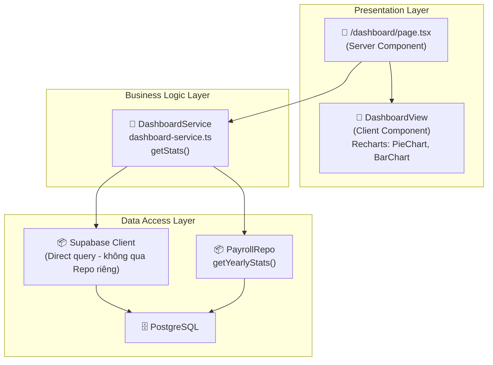

# 📊 Phân tích Chi tiết Trang Dashboard Thống kê Nhân viên (Dashboard Analytics Workflow)

Tài liệu này mô tả chi tiết luồng nghiệp vụ **Dashboard thống kê thông tin nhân viên** trong hệ thống HRMS, bao gồm các chỉ số KPI, biểu đồ phân tích, và cách hệ thống tổng hợp dữ liệu từ nhiều bảng để hiển thị trên trang tổng quan.

## 1. Tổng quan

Dashboard là trang tổng quan dành cho Admin/Manager, cung cấp cái nhìn toàn cảnh về tình hình nhân sự trong tổ chức. Trang này tổng hợp dữ liệu real-time từ nhiều nguồn: nhân viên, chấm công, nghỉ phép và bảng lương, rồi hiển thị dưới dạng các thẻ KPI, biểu đồ tròn (Pie Chart) và biểu đồ cột (Bar Chart).

### 🎭 Các Tác nhân (Actors)
1.  **Admin (Quản trị viên)**: Xem toàn bộ thống kê hệ thống.
2.  **Manager (Quản lý)**: Xem thống kê tổng quan.
3.  **System (Hệ thống)**: Tổng hợp, tính toán và trả về dữ liệu thống kê.

### 📈 Các Chỉ số Thống kê (KPIs)
| # | Chỉ số | Mô tả | Nguồn dữ liệu |
| :---: | :--- | :--- | :--- |
| 1 | Tổng số nhân viên | Đếm tất cả nhân viên trong hệ thống | `employees` (COUNT) |
| 2 | Check-in hôm nay | Số nhân viên đã chấm công ngày hôm nay | `attendances` (COUNT WHERE date = today) |
| 3 | Đơn nghỉ chờ duyệt | Số đơn nghỉ phép đang ở trạng thái Pending | `leave_requests` (COUNT WHERE status = 'Pending') |
| 4 | Nhân viên mới nhất | 4 nhân viên được tuyển gần đây nhất | `employees` (ORDER BY hire_date DESC LIMIT 4) |
| 5 | Phân bổ theo phòng ban | Pie Chart thể hiện tỷ lệ nhân viên mỗi phòng ban | `employees` JOIN `departments` (GROUP BY) |
| 6 | Nghỉ phép sắp tới | 5 đơn nghỉ phép đã duyệt sắp diễn ra | `leave_requests` (Approved, start_date >= today) |
| 7 | Thống kê lương theo tháng | Bar Chart lương đã thanh toán vs chưa thanh toán trong năm | `payslips` (GROUP BY month, SUM net_pay) |

---

## 2. Chi tiết Quy trình (Step-by-Step)

### Bước 1: Truy cập Dashboard
*   **Hành động**: Admin/Manager đăng nhập và truy cập trang `/dashboard`.
*   **Xử lý**: `DashboardPage` (Server Component) gọi `dashboardService.getStats()`.

### Bước 2: Hệ thống Tổng hợp Dữ liệu
Service `getStats()` thực hiện **7 truy vấn** tới Database (qua Supabase Client):

#### 2.1. Tổng số nhân viên
```
SELECT COUNT(*) FROM employees
```
*   **Kỹ thuật**: Dùng `{ count: 'exact', head: true }` để chỉ lấy count, không fetch data.

#### 2.2. Số Check-in hôm nay
```
SELECT COUNT(*) FROM attendances WHERE date = TODAY
```
*   **Logic**: So sánh `date` với ngày hiện tại (ISO format: `YYYY-MM-DD`).

#### 2.3. Đơn nghỉ phép Pending
```
SELECT COUNT(*) FROM leave_requests WHERE status = 'Pending'
```

#### 2.4. Nhân viên mới nhất
```
SELECT id, first_name, last_name, avatar, department_id, departments(name)
FROM employees
ORDER BY hire_date DESC
LIMIT 4
```
*   **Xử lý thêm**: Map dữ liệu để xử lý `departments` có thể là Array hoặc Object (do Supabase JOIN).

#### 2.5. Phân bổ theo Phòng ban (Pie Chart)
```
SELECT department_id, departments(name) FROM employees
```
*   **Xử lý JS**: Group by `department_name`, đếm số nhân viên mỗi phòng ban.
*   **Output**: `[{ name: "IT", value: 15, color: "#a855f7" }, ...]`.
*   **Màu sắc**: Xoay vòng 5 màu: `['#a855f7', '#ef4444', '#eab308', '#14b8a6', '#3b82f6']`.

#### 2.6. Nghỉ phép sắp tới
```
SELECT *, employees(first_name, last_name, avatar)
FROM leave_requests
WHERE status = 'Approved' AND start_date >= TODAY
ORDER BY start_date ASC
LIMIT 5
```

#### 2.7. Thống kê Lương theo tháng (Bar Chart)
*   **Gọi**: `payrollRepo.getYearlyStats(currentYear)` → Lấy tất cả payslip trong năm.
*   **Xử lý JS**: Với mỗi tháng (1 → 12), tổng hợp:
    *   `received`: Tổng `net_pay` của các payslip có `status = 'Paid'`.
    *   `pending`: Tổng `net_pay` của các payslip chưa thanh toán.
*   **Output**: `[{ name: "Jan", received: 50000000, pending: 10000000 }, ...]`.

### Bước 3: Render Giao diện
*   Component `DashboardView` (Client Component) nhận props `stats` và render:
    *   **Thẻ KPI**: 3 card hiển thị Tổng NV, Check-in, Đơn chờ duyệt.
    *   **Pie Chart**: Biểu đồ tròn phân bổ phòng ban (Recharts).
    *   **Bar Chart**: Biểu đồ cột lương theo tháng (Recharts).
    *   **Danh sách**: NV mới nhất, nghỉ phép sắp tới.

---

## 3. Biểu đồ Tuần tự (Sequence Diagram)



---

## 4. Biểu đồ Luồng Dữ liệu (Data Flow Diagram)



---

## 5. Cấu trúc Dữ liệu & Quy tắc Nghiệp vụ

### 🗄️ Các Bảng Nguồn Dữ liệu
| Bảng | Trường sử dụng | Mục đích |
| :--- | :--- | :--- |
| `employees` | `id`, `first_name`, `last_name`, `avatar`, `department_id`, `hire_date` | KPI tổng NV, NV mới, phân bổ phòng ban |
| `departments` | `name` | Tên phòng ban cho Pie Chart |
| `attendances` | `date` | Đếm check-in hôm nay |
| `leave_requests` | `status`, `start_date`, `employees(*)` | Đếm pending, danh sách sắp tới |
| `payslips` | `month`, `status`, `net_pay` | Biểu đồ lương theo tháng |

### ⛔ Business Rules (Logic Code)
1.  **Real-time Data**: Dashboard luôn lấy dữ liệu mới nhất từ DB (không cache lâu dài) qua `force-dynamic`.
2.  **Date Logic**: Ngày hôm nay được tính bằng `new Date().toISOString().split('T')[0]` (UTC).
3.  **Department Grouping**: Dùng `reduce()` để group by department name, xử lý cả trường hợp `departments` là Array hoặc Object.
4.  **Salary Aggregation**: Phân biệt `Paid` vs các trạng thái khác (Draft, Processing) để tách `received` và `pending`.
5.  **Yearly Scope**: Thống kê lương chỉ trong năm hiện tại (`currentYear = new Date().getFullYear()`).
6.  **Null Safety**: Tất cả giá trị count/data đều fallback về giá trị mặc định (`0`, `[]`).

---

## 6. Kiến trúc Code (3-Layer Architecture)



### Đặc điểm Kiến trúc
*   **Dashboard Service** truy vấn trực tiếp qua Supabase Client (không qua Repository riêng) vì các query là read-only và đặc thù cho dashboard.
*   Ngoại trừ thống kê lương, được delegate cho `PayrollRepo.getYearlyStats()` vì logic phức tạp hơn.
*   **Client Component** (`DashboardView`) sử dụng thư viện **Recharts** để render biểu đồ tương tác.

---
*Tài liệu dựa trên phân tích source code: `server/services/dashboard-service.ts`, `server/repositories/payroll-repo.ts`, `components/dashboard/DashboardView.tsx`.*
