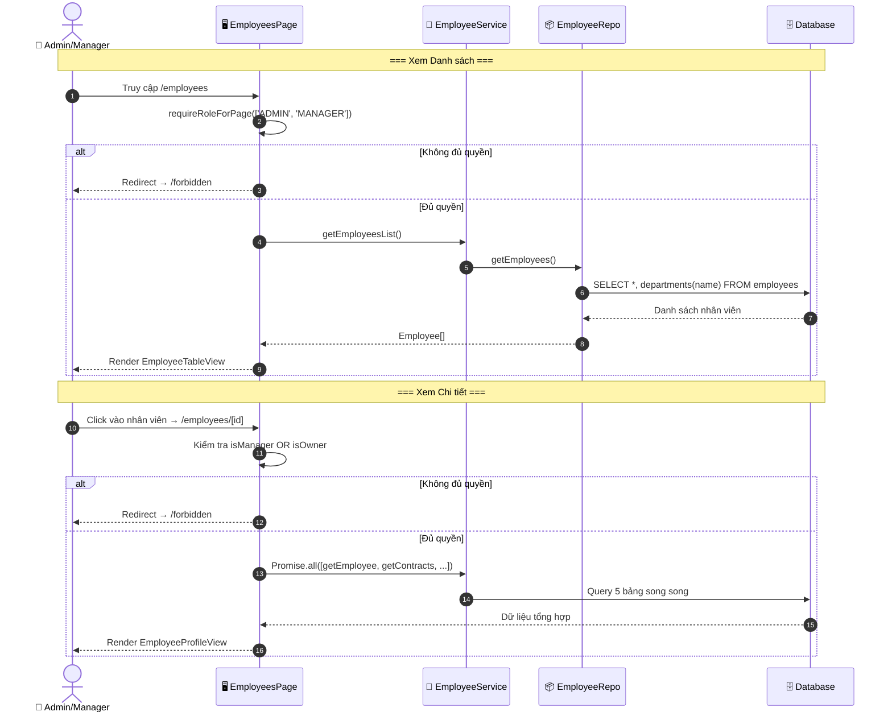
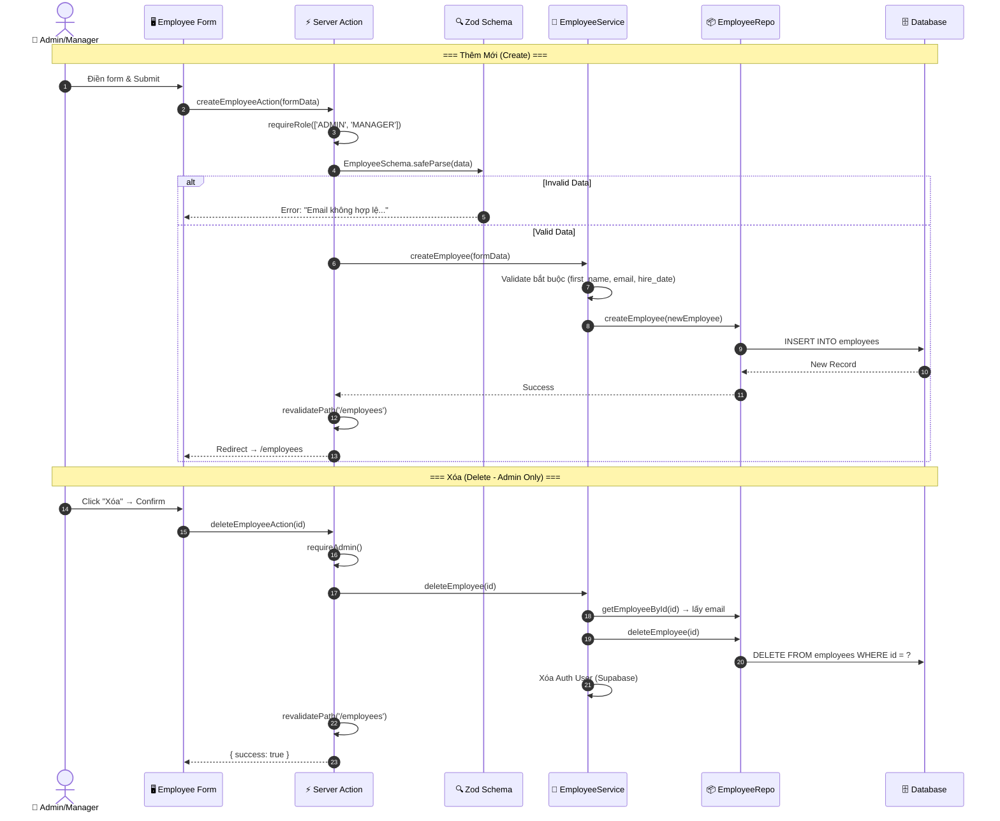
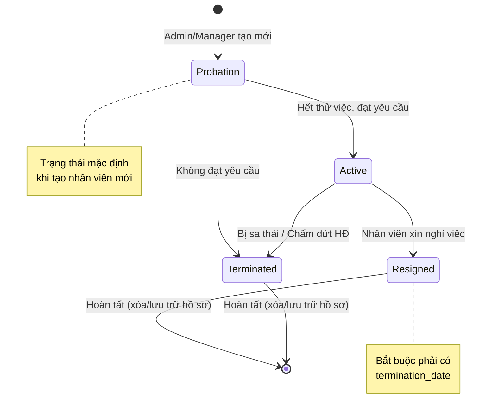
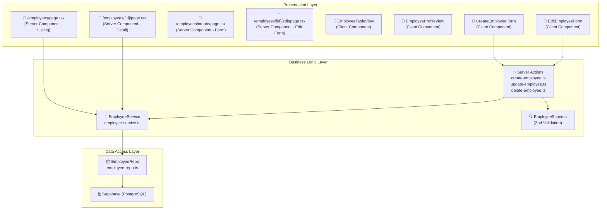

# 👤 Phân tích Chi tiết Quy trình CRUD Nhân viên (Employee Management Workflow)

Tài liệu này mô tả chi tiết luồng nghiệp vụ **Quản lý Nhân viên (CRUD)** trong hệ thống HRMS, bao gồm các thao tác: Xem danh sách (Listing), Xem chi tiết (Detail), Thêm mới (Create), Cập nhật (Update) và Xóa (Delete) nhân viên, cùng với các quy tắc nghiệp vụ, phân quyền và cấu trúc dữ liệu liên quan.

## 1. Tổng quan

Module quản lý nhân viên là hạt nhân của hệ thống HRMS. Nó cho phép Admin/Manager thao tác CRUD toàn bộ hồ sơ nhân viên, bao gồm thông tin cá nhân, phòng ban, lương, quota nghỉ phép và trạng thái làm việc. Nhân viên thường chỉ có quyền xem hồ sơ cá nhân của mình.

### 🎭 Các Tác nhân (Actors)
1.  **Admin (Quản trị viên)**: Toàn quyền CRUD, xóa nhân viên, quản lý tài khoản.
2.  **Manager (Quản lý)**: Được phép xem danh sách, thêm và cập nhật nhân viên.
3.  **Employee (Nhân viên)**: Chỉ xem hồ sơ cá nhân của mình (trang Profile).
4.  **System (Hệ thống)**: Validate dữ liệu, phân quyền, xử lý upload avatar, đồng bộ Auth.

### 🛡️ Ma trận Phân quyền (RBAC)
| Thao tác | Admin | Manager | Employee |
| :--- | :---: | :---: | :---: |
| Xem danh sách nhân viên | ✅ | ✅ | ❌ |
| Xem chi tiết nhân viên | ✅ | ✅ | Chỉ bản thân |
| Thêm nhân viên mới | ✅ | ✅ | ❌ |
| Cập nhật nhân viên | ✅ | ✅ | ❌ |
| Xóa nhân viên | ✅ | ❌ | ❌ |
| Cấp tài khoản đăng nhập | ✅ | ❌ | ❌ |

---

## 2. Chi tiết Quy trình (Step-by-Step)

### Bước 1: Xem danh sách nhân viên (Listing Page)
*   **Hành động**: Admin/Manager truy cập trang `/employees`.
*   **Kiểm tra phân quyền**: Middleware `requireRoleForPage(['ADMIN', 'MANAGER'])` chặn Employee truy cập.
*   **Xử lý hệ thống**:
    1.  `EmployeesPage` (Server Component) gọi `employeeService.getEmployeesList()`.
    2.  Service gọi `employeeRepo.getEmployees()` → Query DB: `SELECT *, departments(id, name) FROM employees ORDER BY hire_date DESC`.
    3.  Dữ liệu trả về bao gồm thông tin nhân viên kèm tên phòng ban (JOIN).
*   **Hiển thị UI**: Component `EmployeeTableView` render bảng nhân viên với:
    *   Bộ lọc: theo phòng ban, theo trạng thái làm việc.
    *   Tìm kiếm: theo tên, email.
    *   Hành động: Xem chi tiết, Sửa, Xóa (theo quyền).

### Bước 2: Xem chi tiết nhân viên (Detail Page)
*   **Hành động**: Người dùng nhấn vào nhân viên → Truy cập `/employees/[id]`.
*   **Kiểm tra phân quyền** (Server-side):
    *   Admin/Manager → Xem bất kỳ hồ sơ nào.
    *   Employee → Chỉ xem nếu `user.employeeId === empId` (chính mình).
    *   Nếu không đủ quyền → Redirect `/forbidden`.
*   **Xử lý hệ thống** (Song song - `Promise.all`):
    1.  `employeeService.getEmployee(id)` → Lấy thông tin nhân viên.
    2.  `contractService.getContracts(id)` → Lấy danh sách hợp đồng.
    3.  `payrollService.getPayrollsByEmployeeId(id)` → Lấy lịch sử lương.
    4.  `leaveService.getLeavesByEmployeeId(id)` → Lấy đơn nghỉ phép.
    5.  `assetService.getAssetsByEmployeeId(id)` → Lấy tài sản được cấp.
*   **Hiển thị**: Component `EmployeeProfileView` với các tab thông tin, hợp đồng, lương, nghỉ phép, tài sản.

### Bước 3: Thêm nhân viên mới (Create)
*   **Hành động**: Admin/Manager nhấn nút "Thêm nhân viên" → Trang `/employees/create`.
*   **Dữ liệu đầu vào** (FormData):
    *   **Bắt buộc**: `first_name`, `last_name`, `email`, `hire_date`.
    *   **Tùy chọn**: `phone`, `department_id`, `salary`, `job_title`, `tax_code`, `dependents`, `probation_end_date`, quota nghỉ phép.
*   **Xử lý hệ thống** (`createEmployeeAction`):
    1.  **Validate quyền**: `requireRole(['ADMIN', 'MANAGER'])`.
    2.  **Validate dữ liệu** (Zod Schema): Kiểm tra tên ≤ 250 ký tự, email hợp lệ, SĐT đúng format, lương ≥ 0, quota ≥ 0, v.v.
    3.  **Business Validate**: Ngày thử việc ≥ ngày vào làm, chức danh phù hợp trạng thái.
    4.  Service `createEmployee(formData)` → Repo `INSERT INTO employees`.
    5.  `revalidatePath('/employees')` → Xóa cache trang danh sách.
*   **Kết quả**: Redirect về `/employees` (thành công) hoặc hiển thị lỗi (thất bại).

### Bước 4: Cập nhật nhân viên (Update)
*   **Hành động**: Admin/Manager nhấn "Sửa" → Trang `/employees/[id]/edit`.
*   **Xử lý hệ thống** (`updateEmployeeAction`):
    1.  **Validate quyền**: `requireManagerOrAbove()`.
    2.  **Validate dữ liệu**: Zod Schema tương tự Bước 3 + validate ngày nghỉ việc.
    3.  **Upload Avatar**: Nếu có file mới → Lưu vào `public/uploads/avatars/`, tên file: `{empId}-{timestamp}.{ext}`.
    4.  Service `updateEmployee(id, formData)` → Repo `UPDATE employees SET ... WHERE id = ?`.
    5.  `revalidatePath('/employees')` + `revalidatePath('/employees/[id]')`.
*   **Kết quả**: Redirect về `/employees`.

### Bước 5: Xóa nhân viên (Delete)
*   **Hành động**: **Chỉ Admin** nhấn nút "Xóa" và xác nhận.
*   **Xử lý hệ thống** (`deleteEmployeeAction`):
    1.  **Validate quyền**: `requireAdmin()` — Chỉ Admin mới có quyền xóa.
    2.  Lấy thông tin nhân viên (email) trước khi xóa.
    3.  `employeeRepo.deleteEmployee(id)` → `DELETE FROM employees WHERE id = ?`.
    4.  **Xóa tài khoản Auth**: Tìm user trong Supabase Auth theo email → `deleteUser()`.
    5.  `revalidatePath('/employees')`.
*   **Lưu ý**: Nếu xóa Auth lỗi → Chỉ log warning, không block quy trình.

---

## 3. Biểu đồ Tuần tự (Sequence Diagram)

### 3.1. Xem Danh sách & Chi tiết

### 3.2. Thêm / Sửa / Xóa

---

## 4. Biểu đồ Trạng thái Nhân viên (State Diagram)

---

## 5. Cấu trúc Dữ liệu & Quy tắc Nghiệp vụ

### 🗄️ Bảng `employees`
| Trường | Kiểu | Mô tả | Quy tắc |
| :--- | :--- | :--- | :--- |
| `id` | bigint | Primary Key | Tự tăng |
| `first_name` | text | Họ | Bắt buộc, ≤ 250 ký tự |
| `last_name` | text | Tên | Bắt buộc, ≤ 250 ký tự |
| `email` | text | Email | Bắt buộc, format email hợp lệ |
| `phone` | text | Số điện thoại | Regex: `0XXXXXXXXX` hoặc `+XXXXXXXXXX` |
| `department_id` | bigint | FK → departments | Nullable |
| `job_title` | text | Chức danh | Không được chứa "thử việc" nếu Active |
| `hire_date` | date | Ngày vào làm | Bắt buộc |
| `probation_end_date` | date | Ngày hết thử việc | Phải ≥ `hire_date` |
| `termination_date` | date | Ngày nghỉ việc | Bắt buộc nếu Resigned/Terminated |
| `salary` | numeric | Lương cơ bản | ≥ 0 |
| `tax_code` | text | Mã số thuế | Chỉ chứa số |
| `dependents` | int | Số người phụ thuộc | ≥ 0, mặc định 0 |
| `employment_status` | text | Trạng thái | Probation / Active / Resigned / Terminated |
| `annual_leave_quota` | numeric | Phép năm | ≥ 0, mặc định 12 |
| `sick_leave_quota` | numeric | Phép ốm | ≥ 0, mặc định 5 |
| `other_leave_quota` | numeric | Phép khác | ≥ 0, mặc định 5 |
| `avatar` | text | Đường dẫn ảnh đại diện | Upload tự động |
| `auth_user_id` | uuid | FK → auth.users | Liên kết tài khoản đăng nhập |

### ⛔ Business Rules (Logic Code)
1.  **Validate Form (Zod Schema)**: Kiểm tra tất cả trường đầu vào trước khi gọi Service.
2.  **Cross-field Validate**: `probation_end_date` ≥ `hire_date`, `termination_date` ≥ `hire_date`.
3.  **Status Logic**: Nếu trạng thái là `Resigned`/`Terminated` → `termination_date` bắt buộc.
4.  **Role Check (Server-side)**:
    *   Xem danh sách → `requireRoleForPage(['ADMIN', 'MANAGER'])`.
    *   Tạo/Sửa → `requireManagerOrAbove()` hoặc `requireRole(['ADMIN', 'MANAGER'])`.
    *   Xóa → `requireAdmin()` (Chỉ Admin).
5.  **Avatar Upload**: Lưu file vào `public/uploads/avatars/{empId}-{timestamp}.ext`.
6.  **Xóa đồng bộ Auth**: Khi xóa nhân viên, đồng thời xóa tài khoản Supabase Auth tương ứng.
7.  **Cache Invalidation**: Sau mỗi thao tác CUD, gọi `revalidatePath()` để cập nhật giao diện.

---

## 6. Kiến trúc Code (3-Layer Architecture)

---
---

## 7. Luồng Xử lý Mã nguồn (Source Code Flow)

Phần này phân tích chi tiết cách các tệp tin (files) phối hợp để thực hiện các thao tác CRUD nhân viên:

### 🛠️ Các Tệp tin (Files) Chính:
1.  **Page (Route)**:
    *   Danh sách: [app/(dashboard)/employees/page.tsx]du_an/cnkt_cnpm/app/(dashboard)/employees/page.tsx
    *   Chi tiết: [app/(dashboard)/employees/[id]/page.tsx]du_an/cnkt_cnpm/app/(dashboard)/employees/[id]/page.tsx
    *   Thêm mới: [app/(dashboard)/employees/create/page.tsx]du_an/cnkt_cnpm/app/(dashboard)/employees/create/page.tsx
    *   Chỉnh sửa: [app/(dashboard)/employees/[id]/edit/page.tsx]du_an/cnkt_cnpm/app/(dashboard)/employees/[id]/edit/page.tsx
2.  **Server Actions (Xử lý Form & CUD)**:
    *   [server/actions/create-employee.ts]du_an/cnkt_cnpm/server/actions/create-employee.ts
    *   [server/actions/update-employee.ts]du_an/cnkt_cnpm/server/actions/update-employee.ts
    *   [server/actions/delete-employee.ts]du_an/cnkt_cnpm/server/actions/delete-employee.ts
3.  **Service & Repository (Giao tiếp Database)**:
    *   Service: [server/services/employee-service.ts]du_an/cnkt_cnpm/server/services/employee-service.ts
    *   Repository: [server/repositories/employee-repo.ts]du_an/cnkt_cnpm/server/repositories/employee-repo.ts
4.  **Schema (Validation)**:
    *   [lib/schemas/employee.schema.ts]du_an/cnkt_cnpm/lib/schemas/employee.schema.ts

### 🔄 Trình tự Xử lý (Logic Flow):

*   **Quy trình Đọc (Read)**:
    1.  Người dùng vào trang Danh sách hoặc Chi tiết.
    2.  `page.tsx` (Server Component) gọi trực tiếp `employeeService.getEmployeesList()` hoặc `getEmployee(id)`.
    3.  Dữ liệu được truyền xuống các Client Component (`EmployeeTableView` hoặc `EmployeeProfileView`) để hiển thị.

*   **Quy trình Ghi (Create/Update/Delete)**:
    1.  Người dùng submit Form (ví dụ: `CreateEmployeeForm`).
    2.  Form gọi đến một **Server Action** (ví dụ: `createEmployeeAction`).
    3.  Server Action sử dụng **Zod Schema** (`employee.schema.ts`) để kiểm tra dữ liệu đầu vào.
    4.  Nếu dữ liệu hợp lệ, Server Action gọi hàm tương ứng trong `employeeService`.
    5.  `employeeService` xử lý logic nghiệp vụ (như kiểm tra quyền, định dạng lại dữ liệu) trước khi gọi `employeeRepo`.
    6.  `employeeRepo` thực hiện lệnh SQL (`INSERT`, `UPDATE`, `DELETE`) thông qua Supabase Client.
    7.  Sau khi thành công, Server Action gọi `revalidatePath()` để làm mới dữ liệu trên giao diện mà không cần reload trang.

---
*Tài liệu dựa trên phân tích source code: `server/services/employee-service.ts`, `server/repositories/employee-repo.ts`, `server/actions/create-employee.ts`, `server/actions/update-employee.ts`, `server/actions/delete-employee.ts`, `lib/schemas/employee.schema.ts`.*
