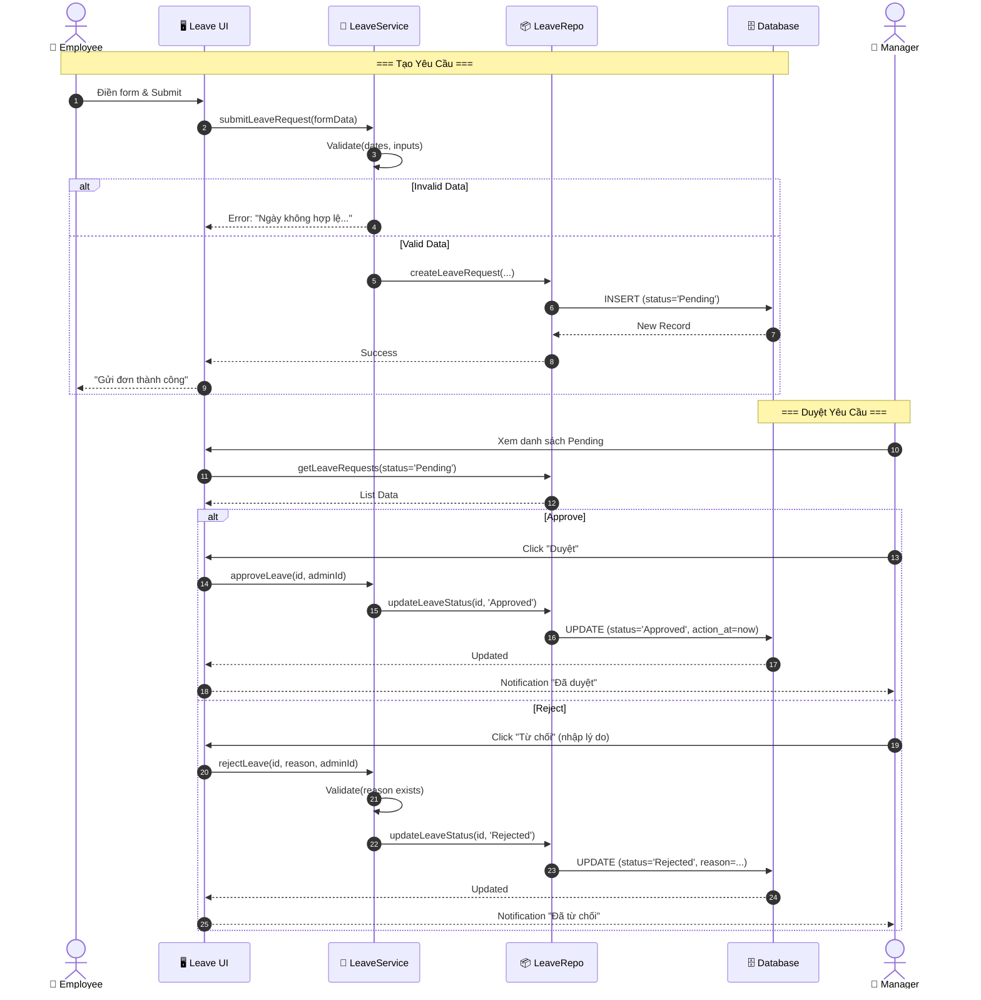
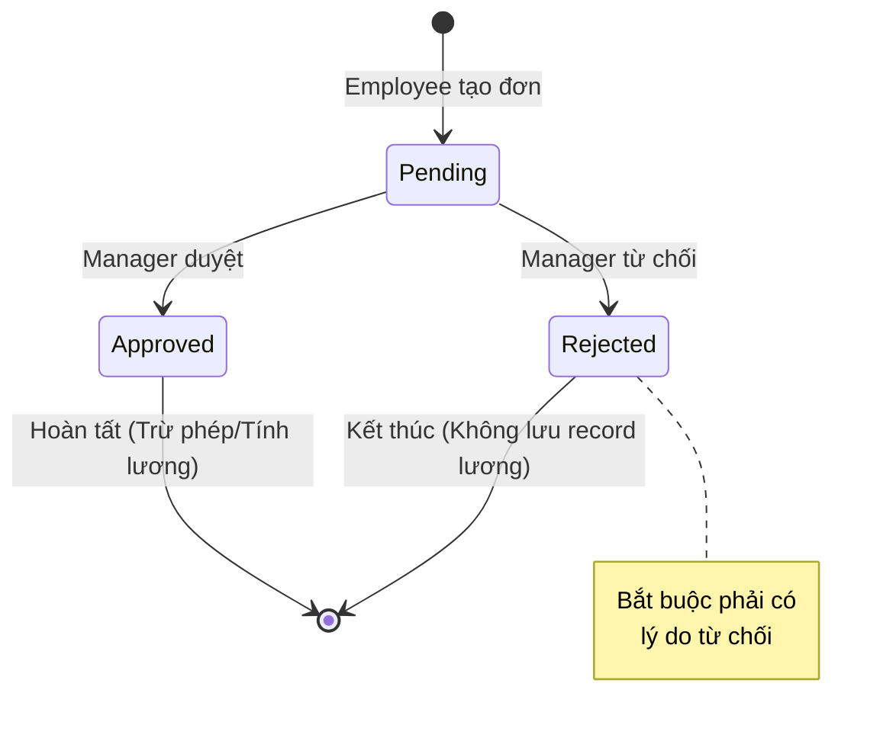

# 🏖️ Phân tích Chi tiết Quy trình Xin Nghỉ phép (Leave Request Workflow)

Tài liệu này mô tả chi tiết luồng nghiệp vụ **Nhân viên xin nghỉ phép** trong hệ thống HRMS, bao gồm các bước từ lúc tạo yêu cầu đến khi được phê duyệt hoặc từ chối, cùng với các quy tắc nghiệp vụ và cấu trúc dữ liệu liên quan.

## 1. Tổng quan
Quy trình cho phép nhân viên gửi yêu cầu nghỉ phép (nghỉ ốm, nghỉ phép năm, việc riêng...) và để Quản lý (Manager/Admin) xem xét phê duyệt. Hệ thống theo dõi trạng thái đơn và cập nhật quota nghỉ phép (dự kiến tích hợp tính lương).

### 🎭 Các Tác nhân (Actors)
1.  **Employee (Nhân viên)**: Người khởi tạo yêu cầu xin nghỉ.
2.  **Manager/Admin (Quản lý)**: Người có quyền duyệt hoặc từ chối yêu cầu.
3.  **System (Hệ thống)**: Thực hiện validate, lưu trữ và cập nhật trạng thái.

### 🚦 Các Trạng thái Đơn (Status)
*   `Pending` (Chờ duyệt): Trạng thái mặc định khi mới tạo.
*   `Approved` (Đã duyệt): Đơn đã được chấp thuận bởi quản lý.
*   `Rejected` (Từ chối): Đơn bị từ chối (bắt buộc có lý do).

---

## 2. Chi tiết Quy trình (Step-by-Step)

### Bước 1: Nhân viên tạo yêu cầu (Submit Request)
*   **Hành động**: Nhân viên truy cập trang cá nhân hoặc Dashboard, chọn chức năng "Xin nghỉ phép".
*   **Dữ liệu đầu vào**:
    *   `leave_type`: Loại nghỉ (Nghỉ phép năm, Nghỉ ốm, Việc riêng...).
    *   `start_date`: Từ ngày.
    *   `end_date`: Đến ngày.
    *   `reason`: Lý do nghỉ (bắt buộc/tùy chọn tùy cấu hình).
*   **Xử lý hệ thống (System Logic)**:
    1.  Validate thông tin bắt buộc: `employee_id`, `leave_type`, `dates`.
    2.  **Validate Logic**: Kiểm tra `end_date` >= `start_date`.
    3.  (Quy tắc mở rộng): Kiểm tra số dư phép (Quota) hiện tại của nhân viên (Annual/Sick/Other Quota).
*   **Kết quả**:
    *   Nếu hợp lệ: Tạo bản ghi trong bảng `leave_requests` với trạng thái `Pending`.
    *   Nếu lỗi: Hiển thị thông báo lỗi (ví dụ: "Ngày kết thúc không hợp lệ").

### Bước 2: Quản lý Tiếp nhận & Xử lý (Review)
*   **Hành động**: Manager đăng nhập, thấy danh sách các yêu cầu `Pending`.
*   **Thông tin hiển thị**: Tên nhân viên, loại nghỉ, thời gian, lý do, số ngày (Duration).

### Bước 3A: Phê duyệt (Approve)
*   **Hành động**: Manager nhấn nút **"Duyệt"**.
*   **Xử lý hệ thống**:
    1.  Cập nhật trạng thái đơn thành `Approved`.
    2.  Lưu thông tin người duyệt (`action_by_employee_id`) và thời gian duyệt (`action_at`).
    3.  Xóa lý do từ chối (nếu có từ trước).
*   **Tác động**: Số ngày nghỉ sẽ được tính vào bảng lương và trừ vào quota nghỉ phép của năm.

### Bước 3B: Từ chối (Reject)
*   **Hành động**: Manager nhấn nút **"Từ chối"**.
*   **Dữ liệu đầu vào**: `rejection_reason` (Lý do từ chối) - **Bắt buộc**.
*   **Xử lý hệ thống**:
    1.  Validate: Phải có lý do từ chối.
    2.  Cập nhật trạng thái đơn thành `Rejected`.
    3.  Lưu lý do từ chối, người từ chối và thời gian.
*   **Tác động**: Đơn bị hủy, không ảnh hưởng đến lương/quota.

---

## 3. Biểu đồ Tuần tự (Sequence Diagram)

---

## 4. Biểu đồ Trạng thái (State Diagram)

---

## 5. Cấu trúc Dữ liệu & Quy tắc Nghiệp vụ

### 🗄️ Bảng `leave_requests`
| Trường | Kiểu | Mô tả | Quy tắc |
| :--- | :--- | :--- | :--- |
| `id` | bigint | Primary Key | Tự tăng |
| `employee_id` | bigint | Foreign Key | Nhân viên xin nghỉ |
| `leave_type` | text | Loại nghỉ | Annual, Sick, Unpaid, v.v. |
| `start_date` | date | Ngày bắt đầu | <= end_date |
| `end_date` | date | Ngày kết thúc | >= start_date |
| `reason` | text | Lý do nghỉ | Tùy chọn |
| `status` | text | Trạng thái | Pending / Approved / Rejected |
| `rejection_reason` | text | Lý do từ chối | Bắt buộc nếu Rejected |
| `action_by_employee_id` | bigint | Người duyệt | Manager/Admin ID |

### ⛔ Business Rules (Logic Code)
1.  **Validate Date**: `end_date` không được nhỏ hơn `start_date`.
2.  **Validate Reject**: Khi từ chối (`rejectLeave`), tham số `rejectionReason` không được để trống hoặc chỉ chứa khoảng trắng.
3.  **Role Check**: Chỉ có `Manager` hoặc `Admin` (check ở Middleware/Page level) mới gọi được API duyệt/từ chối.

---
*Tài liệu dựa trên phân tích source code: `server/services/leave-service.ts` và `server/repositories/leave-repo.ts`.*
