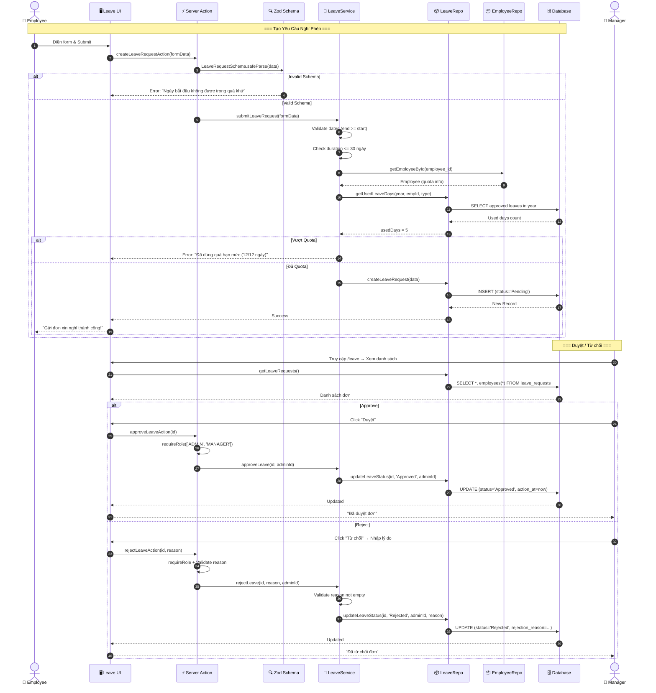
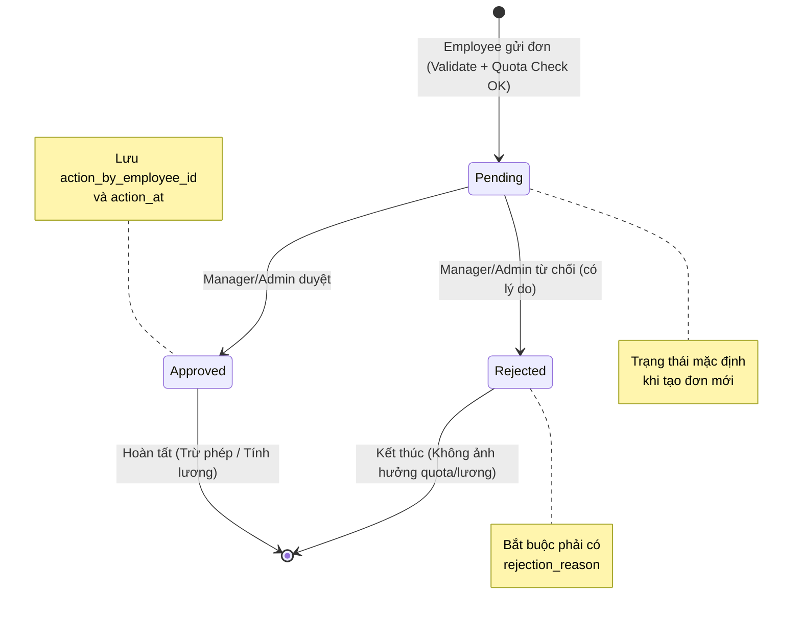
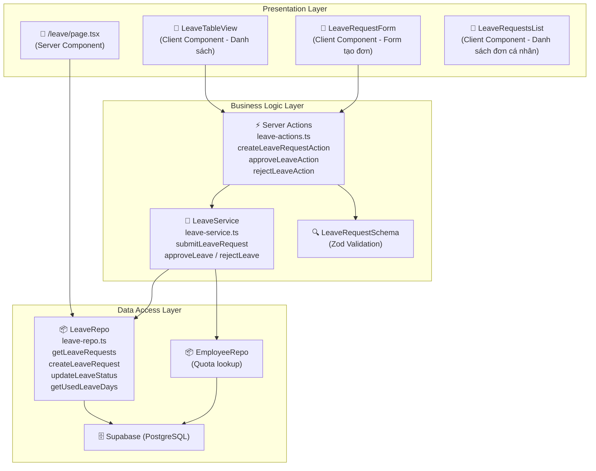

# 🏖️ Phân tích Chi tiết Quy trình Xin Nghỉ phép (Leave Request Workflow)

Tài liệu này mô tả chi tiết luồng nghiệp vụ **Nhân viên xin nghỉ phép** trong hệ thống HRMS, bao gồm các bước từ lúc tạo yêu cầu đến khi được phê duyệt hoặc từ chối, cùng với các quy tắc nghiệp vụ, kiểm tra Quota, phân quyền và cấu trúc dữ liệu liên quan.

## 1. Tổng quan
Quy trình cho phép nhân viên gửi yêu cầu nghỉ phép (nghỉ ốm, nghỉ phép năm, việc riêng...) và để Quản lý (Manager/Admin) xem xét phê duyệt. Hệ thống theo dõi trạng thái đơn, validate hạn mức (quota), và cập nhật quota nghỉ phép (tích hợp tính lương).

### 🎭 Các Tác nhân (Actors)
1.  **Employee (Nhân viên)**: Người khởi tạo yêu cầu xin nghỉ.
2.  **Manager/Admin (Quản lý)**: Người có quyền duyệt hoặc từ chối yêu cầu.
3.  **System (Hệ thống)**: Thực hiện validate, kiểm tra quota, lưu trữ và cập nhật trạng thái.

### 🚦 Các Trạng thái Đơn (Status)
*   `Pending` (Chờ duyệt): Trạng thái mặc định khi mới tạo.
*   `Approved` (Đã duyệt): Đơn đã được chấp thuận bởi quản lý.
*   `Rejected` (Từ chối): Đơn bị từ chối (bắt buộc có lý do).

### 🛡️ Ma trận Phân quyền (RBAC)
| Thao tác | Admin | Manager | Employee |
| :--- | :---: | :---: | :---: |
| Xem danh sách tất cả đơn | ✅ | ✅ | ❌ |
| Xem đơn của bản thân | ✅ | ✅ | ✅ |
| Gửi đơn xin nghỉ | ✅ | ✅ | ✅ |
| Duyệt đơn | ✅ | ✅ | ❌ |
| Từ chối đơn | ✅ | ✅ | ❌ |

---

## 2. Chi tiết Quy trình (Step-by-Step)

### Bước 1: Nhân viên tạo yêu cầu (Submit Request)
*   **Hành động**: Nhân viên truy cập trang `/leave` hoặc trang Profile, chọn chức năng "Xin nghỉ phép".
*   **Dữ liệu đầu vào**:
    *   `leave_type`: Loại nghỉ (Annual Leave, Sick Leave, Unpaid...).
    *   `start_date`: Từ ngày — **Không được trong quá khứ**.
    *   `end_date`: Đến ngày — **Phải ≥ start_date**.
    *   `reason`: Lý do nghỉ (tùy chọn).
*   **Xử lý hệ thống** (`createLeaveRequestAction`):
    1.  **Validate Schema (Zod)**: Kiểm tra các trường bắt buộc, format ngày, logic ngày.
    2.  **Validate Service Logic**:
        *   Kiểm tra `end_date >= start_date`.
        *   Tính `duration` = số ngày nghỉ.
        *   **Safety Check**: `duration ≤ 30` ngày/lần gửi.
        *   **Quota Check**: Lấy quota từ bảng `employees` → Tính số ngày đã dùng trong năm (`getUsedLeaveDays`) → So sánh `usedDays + requestDuration ≤ limit`.
    3.  **Lưu DB**: `INSERT INTO leave_requests` với `status = 'Pending'`.
    4.  `revalidatePath('/leave')` + `revalidatePath('/profile')`.
*   **Kết quả**:
    *   Nếu hợp lệ: Tạo bản ghi thành công, hiển thị "Gửi đơn thành công!".
    *   Nếu lỗi: Hiển thị thông báo cụ thể (ví dụ: "Bạn đã dùng quá số ngày nghỉ phép quy định").

### Bước 2: Quản lý Tiếp nhận & Xử lý (Review)
*   **Hành động**: Manager/Admin đăng nhập, truy cập `/leave`.
*   **Dữ liệu từ Server**:
    *   `leaveRepo.getLeaveRequests()` → Danh sách tất cả đơn (JOIN employees).
    *   `employeeRepo.getEmployees()` + `getDepartments()` → Thông tin nhân viên, phòng ban.
*   **Thông tin hiển thị**: Tên nhân viên, avatar, loại nghỉ, thời gian, lý do, trạng thái, nút hành động.
*   **Bộ lọc UI**: Lọc theo trạng thái (Pending/Approved/Rejected), theo phòng ban, tìm kiếm theo tên.

### Bước 3A: Phê duyệt (Approve)
*   **Hành động**: Manager nhấn nút **"Duyệt"**.
*   **Xử lý hệ thống** (`approveLeaveAction`):
    1.  **Validate quyền**: `requireRole(['ADMIN', 'MANAGER'])`.
    2.  Lấy `currentUser.employeeId` làm `action_by_employee_id`.
    3.  Gọi `leaveService.approveLeave(id, actionByEmployeeId)`.
    4.  Repo cập nhật:
        *   `status = 'Approved'`
        *   `action_at = now()`
        *   `action_by_employee_id = managerId`
        *   `rejection_reason = NULL` (xóa lý do cũ nếu có).
    5.  `revalidatePath('/leave')` + `revalidatePath('/profile')`.
*   **Tác động**: Số ngày nghỉ sẽ được tính vào bảng lương và trừ vào quota nghỉ phép của năm.

### Bước 3B: Từ chối (Reject)
*   **Hành động**: Manager nhấn nút **"Từ chối"**.
*   **Dữ liệu đầu vào**: `rejection_reason` (Lý do từ chối) — **Bắt buộc**.
*   **Xử lý hệ thống** (`rejectLeaveAction`):
    1.  **Validate quyền**: `requireRole(['ADMIN', 'MANAGER'])`.
    2.  **Validate lý do**: Kiểm tra `rejectionReason` không rỗng (cả ở Action lẫn Service).
    3.  Gọi `leaveService.rejectLeave(id, rejectionReason, actionByEmployeeId)`.
    4.  Repo cập nhật:
        *   `status = 'Rejected'`
        *   `rejection_reason = "..."`
        *   `action_at = now()`
        *   `action_by_employee_id = managerId`
    5.  `revalidatePath('/leave')` + `revalidatePath('/profile')`.
*   **Tác động**: Đơn bị hủy, không ảnh hưởng đến lương/quota.

---

## 3. Biểu đồ Tuần tự (Sequence Diagram)

---

## 4. Biểu đồ Trạng thái (State Diagram)

---

## 5. Cấu trúc Dữ liệu & Quy tắc Nghiệp vụ

### 🗄️ Bảng `leave_requests`
| Trường | Kiểu | Mô tả | Quy tắc |
| :--- | :--- | :--- | :--- |
| `id` | bigint | Primary Key | Tự tăng |
| `employee_id` | bigint | Foreign Key → employees | Nhân viên xin nghỉ |
| `leave_type` | text | Loại nghỉ | Annual Leave, Sick Leave, Unpaid, v.v. |
| `start_date` | date | Ngày bắt đầu | ≤ end_date, **Không được trong quá khứ** |
| `end_date` | date | Ngày kết thúc | ≥ start_date |
| `reason` | text | Lý do nghỉ | Tùy chọn |
| `status` | text | Trạng thái | Pending / Approved / Rejected |
| `rejection_reason` | text | Lý do từ chối | Bắt buộc nếu Rejected |
| `action_by_employee_id` | bigint | Người duyệt/từ chối | FK → employees (Manager/Admin ID) |
| `action_at` | timestamp | Thời gian duyệt/từ chối | Tự động set khi thay đổi status |
| `created_at` | timestamp | Thời gian tạo đơn | Tự động |

### 🗄️ Bảng `employees` (Quota liên quan)
| Trường | Kiểu | Mô tả | Mặc định |
| :--- | :--- | :--- | :--- |
| `annual_leave_quota` | numeric | Số ngày phép năm tối đa | 12 |
| `sick_leave_quota` | numeric | Số ngày phép ốm tối đa | 5 |
| `other_leave_quota` | numeric | Số ngày phép khác tối đa | 5 |

### ⛔ Business Rules (Logic Code)

#### Validate Đầu vào (Zod Schema — `leave.schema.ts`)
1.  **Required Fields**: `leave_type`, `start_date`, `end_date` phải có giá trị.
2.  **Past Date Check**: `start_date` không được trong quá khứ (so sánh với ngày hiện tại, normalize về 00:00:00).
3.  **Date Logic**: `end_date` >= `start_date`.

#### Validate Nghiệp vụ (Service — `leave-service.ts`)
4.  **Max Duration**: Mỗi đơn không được quá **30 ngày** (Safety Check).
5.  **Quota Check**: `usedDays + requestDuration ≤ quota_limit`. Hạn mức phụ thuộc loại nghỉ:
    *   `Annual Leave` → `annual_leave_quota` (mặc định 12).
    *   `Sick Leave` → `sick_leave_quota` (mặc định 5).
    *   Khác → `other_leave_quota` (mặc định 5).
6.  **Used Days Calculation**: Tổng hợp tất cả đơn `Approved` cùng loại trong cùng năm, tính tổng số ngày.

#### Validate Phê duyệt/Từ chối (Action — `leave-actions.ts`)
7.  **Role Check**: Chỉ `ADMIN` hoặc `MANAGER` mới gọi được API duyệt/từ chối.
8.  **Reject Reason**: Khi từ chối, `rejectionReason` không được để trống (validate ở cả Action lẫn Service — **double validation**).
9.  **Clear Rejection**: Khi duyệt một đơn đã bị reject trước đó, `rejection_reason` bị xóa (`NULL`).

#### Tích hợp Payroll
10. **Approved Leaves → Payroll**: Bảng lương lấy dữ liệu từ `leaveRepo.getApprovedLeaves(month, year, empId)` để tính ngày nghỉ có phép/không phép.

---

## 6. Kiến trúc Code (3-Layer Architecture)

### Đặc điểm Kiến trúc
*   **Double Validation**: Dữ liệu được validate ở 2 lớp — Zod Schema (Action layer) và Business Logic (Service layer) → Đảm bảo an toàn ngay cả khi bị bypass form.
*   **Cross-Service Call**: `LeaveService` gọi `EmployeeRepo` để kiểm tra quota → Tách riêng trách nhiệm nhưng vẫn bảo toàn nghiệp vụ.
*   **Audit Trail**: Mỗi hành động duyệt/từ chối đều lưu `action_by_employee_id` và `action_at` → Truy vết người phê duyệt.

---
*Tài liệu dựa trên phân tích source code: `server/services/leave-service.ts`, `server/repositories/leave-repo.ts`, `server/actions/leave-actions.ts`, `lib/schemas/leave.schema.ts`.*
