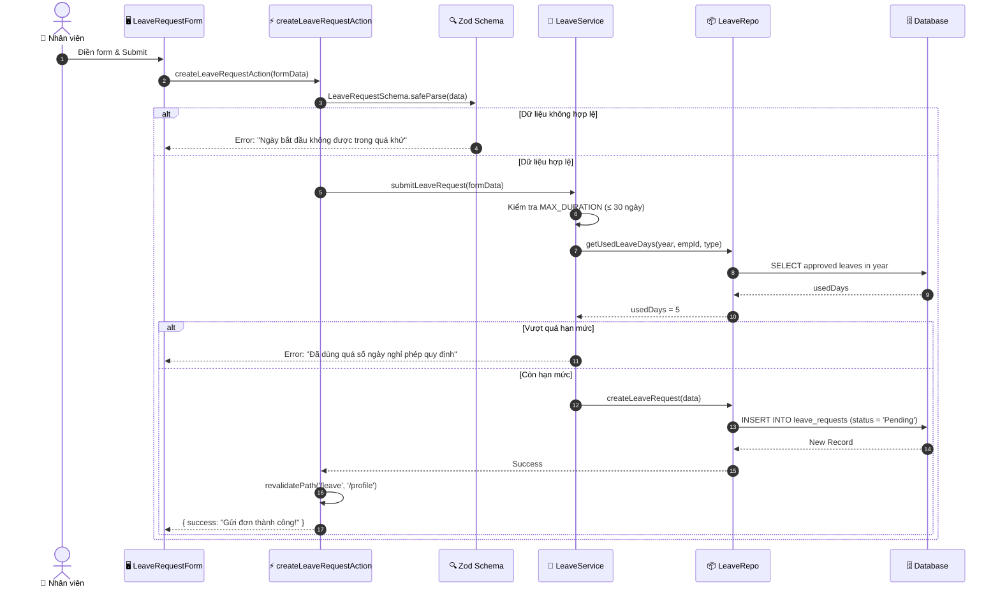
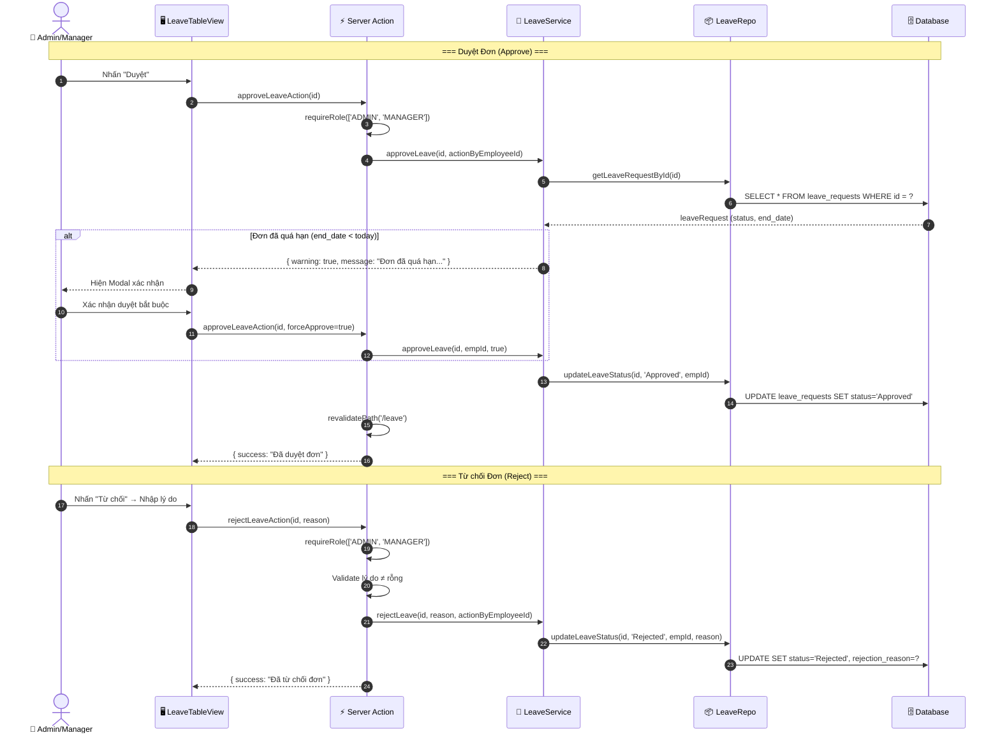
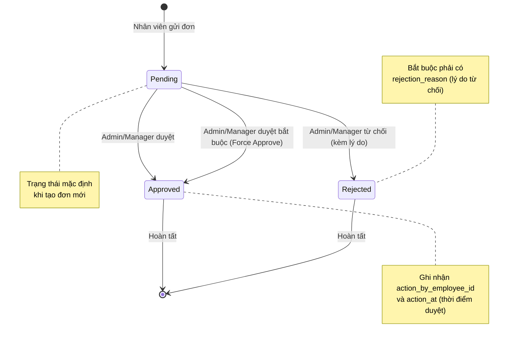
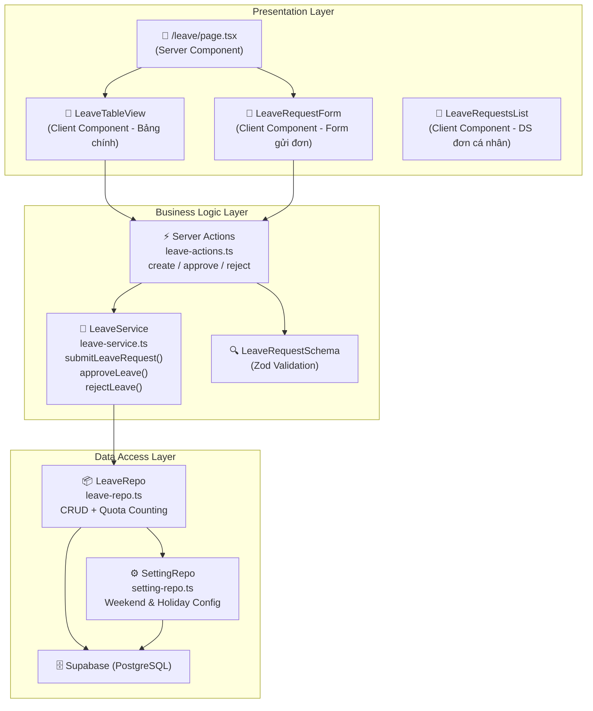

# 📋 Phân tích Chi tiết Luồng Nghỉ phép: Đăng ký → Duyệt Đơn (Leave Request & Approval Workflow)

Tài liệu này mô tả chi tiết luồng nghiệp vụ **Quản lý Nghỉ phép** trong hệ thống HRMS, bao gồm: Nhân viên gửi đơn xin nghỉ, Admin/Manager duyệt hoặc từ chối đơn, cùng các quy tắc nghiệp vụ về hạn mức phép, phân quyền và xử lý ngoại lệ.

## 1. Tổng quan

Module Nghỉ phép cho phép nhân viên chủ động gửi đơn xin nghỉ qua hệ thống, sau đó Admin/Manager sẽ xem xét và quyết định duyệt hoặc từ chối. Hệ thống tự động kiểm tra hạn mức phép còn lại, validate ngày tháng và ghi nhận lịch sử xử lý.

### 🎭 Các Tác nhân (Actors)
1.  **Employee (Nhân viên)**: Gửi đơn xin nghỉ phép với loại phép, khoảng thời gian và lý do.
2.  **Admin (Quản trị viên)**: Duyệt hoặc từ chối đơn nghỉ phép của bất kỳ nhân viên nào.
3.  **Manager (Quản lý)**: Duyệt hoặc từ chối đơn nghỉ phép.
4.  **System (Hệ thống)**: Validate dữ liệu, kiểm tra hạn mức phép, tính số ngày làm việc thực tế.

### 🛡️ Ma trận Phân quyền (RBAC)
| Thao tác | Admin | Manager | Employee |
| :--- | :---: | :---: | :---: |
| Xem tất cả đơn nghỉ phép | ✅ | ✅ | ❌ |
| Xem đơn nghỉ phép của mình | ✅ | ✅ | ✅ |
| Gửi đơn xin nghỉ | ✅ | ✅ | ✅ |
| Duyệt đơn nghỉ phép | ✅ | ✅ | ❌ |
| Từ chối đơn nghỉ phép | ✅ | ✅ | ❌ |

### 📊 Các Loại Nghỉ phép & Hạn mức
| Loại nghỉ phép | Hạn mức mặc định/năm | Ghi chú |
| :--- | :---: | :--- |
| Annual Leave (Phép năm) | 12 ngày | Có thể tùy chỉnh theo từng nhân viên |
| Sick Leave (Phép ốm) | 5 ngày | Có thể tùy chỉnh theo từng nhân viên |
| Other Leave (Phép khác) | 5 ngày | Có thể tùy chỉnh theo từng nhân viên |

---

## 2. Chi tiết Quy trình (Step-by-Step)

### Bước 1: Nhân viên Gửi đơn Xin nghỉ (Submit Leave Request)
*   **Hành động**: Nhân viên truy cập trang `/leave` và nhấn nút "Gửi đơn xin nghỉ".
*   **Dữ liệu đầu vào** (FormData):
    *   **Bắt buộc**: `employee_id`, `leave_type`, `start_date`, `end_date`.
    *   **Tùy chọn**: `reason` (Lý do nghỉ).
*   **Xử lý hệ thống** (`createLeaveRequestAction`):
    1.  **Validate Form (Zod Schema)**: Kiểm tra loại phép bắt buộc, ngày bắt đầu không được trong quá khứ, ngày kết thúc ≥ ngày bắt đầu.
    2.  **Validate hạn mức (Quota Check)**:
        *   Tính số ngày xin nghỉ (`requestDuration`).
        *   Kiểm tra không quá 30 ngày/lần gửi (`MAX_DURATION_PER_REQUEST`).
        *   Truy vấn số ngày phép đã dùng trong năm (`getUsedLeaveDays`).
        *   So sánh: `(đã dùng + đang xin) ≤ hạn mức` → Nếu vượt quá → báo lỗi chi tiết.
    3.  **Lưu vào Database**: `INSERT INTO leave_requests` với `status = 'Pending'`.
    4.  **Cập nhật UI**: `revalidatePath('/leave')` + `revalidatePath('/profile')`.
*   **Kết quả**: Hiển thị thông báo "Gửi đơn thành công!" hoặc thông báo lỗi chi tiết.

### Bước 2: Admin/Manager Xem danh sách đơn (Review)
*   **Hành động**: Admin/Manager truy cập trang `/leave`.
*   **Xử lý hệ thống**:
    1.  `LeavePage` (Server Component) gọi `Promise.all` để lấy song song: danh sách đơn nghỉ, danh sách nhân viên, danh sách phòng ban.
    2.  Dữ liệu đơn nghỉ bao gồm JOIN với bảng `employees` (tên, avatar) để hiển thị trực quan.
*   **Hiển thị**: Component `LeaveTableView` render bảng danh sách với:
    *   Bộ lọc: theo trạng thái (Pending / Approved / Rejected), theo phòng ban.
    *   Hành động: Duyệt, Từ chối (hiển thị theo quyền).

### Bước 3: Duyệt đơn Nghỉ phép (Approve)
*   **Hành động**: Admin/Manager nhấn nút "Duyệt" trên đơn đang ở trạng thái Pending.
*   **Xử lý hệ thống** (`approveLeaveAction`):
    1.  **Kiểm tra quyền**: `requireRole(['ADMIN', 'MANAGER'])`.
    2.  **Kiểm tra trạng thái**: Chỉ được duyệt đơn ở trạng thái `Pending`.
    3.  **Kiểm tra ngày quá hạn (Late Approval)**:
        *   Nếu `end_date < today` (đơn đã qua hạn) → **Không duyệt tự động** → Trả về `warning` cho UI.
        *   UI hiển thị Modal xác nhận: "Đơn này đã quá hạn. Bạn có chắc chắn muốn duyệt?".
        *   Nếu Admin xác nhận → Gọi lại với `forceApprove = true` → Duyệt bắt buộc.
    4.  **Cập nhật Database**: `UPDATE leave_requests SET status = 'Approved', action_by_employee_id = ?, action_at = NOW()`.
    5.  **Cập nhật UI**: `revalidatePath('/leave')` + `revalidatePath('/profile')`.

### Bước 4: Từ chối đơn Nghỉ phép (Reject)
*   **Hành động**: Admin/Manager nhấn nút "Từ chối" → Nhập lý do từ chối.
*   **Xử lý hệ thống** (`rejectLeaveAction`):
    1.  **Kiểm tra quyền**: `requireRole(['ADMIN', 'MANAGER'])`.
    2.  **Validate lý do**: Lý do từ chối là **bắt buộc** và không được rỗng.
    3.  **Cập nhật Database**: `UPDATE leave_requests SET status = 'Rejected', rejection_reason = ?, action_by_employee_id = ?, action_at = NOW()`.
    4.  **Cập nhật UI**: `revalidatePath('/leave')` + `revalidatePath('/profile')`.

---

## 3. Biểu đồ Tuần tự (Sequence Diagram)

### 3.1. Nhân viên Gửi đơn

### 3.2. Admin/Manager Duyệt / Từ chối

---

## 4. Biểu đồ Trạng thái Đơn Nghỉ phép (State Diagram)

---

## 5. Cấu trúc Dữ liệu & Quy tắc Nghiệp vụ

### 🗄️ Bảng `leave_requests`
| Trường | Kiểu | Mô tả | Quy tắc |
| :--- | :--- | :--- | :--- |
| `id` | bigint | Primary Key | Tự tăng |
| `employee_id` | bigint | FK → employees | Bắt buộc |
| `leave_type` | text | Loại phép | Bắt buộc: Annual / Sick / Other |
| `start_date` | date | Ngày bắt đầu nghỉ | Bắt buộc, không được trong quá khứ |
| `end_date` | date | Ngày kết thúc nghỉ | Bắt buộc, ≥ start_date |
| `reason` | text | Lý do xin nghỉ | Tùy chọn |
| `status` | text | Trạng thái | Pending / Approved / Rejected |
| `rejection_reason` | text | Lý do từ chối | Bắt buộc nếu status = Rejected |
| `action_by_employee_id` | bigint | FK → employees | Người duyệt/từ chối |
| `action_at` | timestamp | Thời điểm xử lý | Tự động ghi khi duyệt/từ chối |
| `created_at` | timestamp | Thời điểm tạo đơn | Tự động |

### ⛔ Business Rules (Logic Code)
1.  **Ngày bắt đầu**: Không được chọn ngày trong quá khứ (Zod Schema validate client-side).
2.  **Ngày kết thúc**: Phải ≥ ngày bắt đầu.
3.  **Giới hạn mỗi lần gửi**: Tối đa 30 ngày/lần (`MAX_DURATION_PER_REQUEST = 30`).
4.  **Kiểm tra hạn mức**: Hệ thống tự động tính số ngày phép đã dùng trong năm (chỉ tính ngày làm việc, bỏ qua cuối tuần & ngày lễ) và so sánh với hạn mức của nhân viên.
5.  **Late Approval**: Nếu duyệt đơn sau khi ngày kết thúc đã qua → Hệ thống cảnh báo và yêu cầu xác nhận (Force Approve).
6.  **Từ chối bắt buộc lý do**: Khi từ chối đơn, lý do từ chối (`rejection_reason`) là bắt buộc.
7.  **Tracking người xử lý**: Ghi nhận `action_by_employee_id` (ai duyệt/từ chối) và `action_at` (thời điểm).
8.  **Cache Invalidation**: Sau mỗi thao tác, gọi `revalidatePath('/leave')` + `revalidatePath('/profile')`.

---

## 6. Kiến trúc Code (3-Layer Architecture)

---

## 7. Luồng Xử lý Mã nguồn (Source Code Flow)

Phần này phân tích chi tiết cách các tệp tin (files) phối hợp để thực hiện luồng nghỉ phép:

### 🛠️ Các Tệp tin (Files) Chính:
1.  **Page (Route)**:
    *   Trang chính: [app/(dashboard)/leave/page.tsx] du_an/cnkt_cnpm/app/(dashboard)/leave/page.tsx
2.  **UI Components**:
    *   Bảng quản lý: [components/leave/LeaveTableView.tsx] du_an/cnkt_cnpm/components/leave/LeaveTableView.tsx
    *   Form gửi đơn: [components/leave/LeaveRequestForm.tsx] du_an/cnkt_cnpm/components/leave/LeaveRequestForm.tsx
    *   Danh sách đơn cá nhân: [components/leave/LeaveRequestsList.tsx] du_an/cnkt_cnpm/components/leave/LeaveRequestsList.tsx
3.  **Server Actions (Xử lý nghiệp vụ)**:
    *   [server/actions/leave-actions.ts] du_an/cnkt_cnpm/server/actions/leave-actions.ts — chứa 3 action: `createLeaveRequestAction`, `approveLeaveAction`, `rejectLeaveAction`
4.  **Service & Repository (Giao tiếp Database)**:
    *   Service: [server/services/leave-service.ts] du_an/cnkt_cnpm/server/services/leave-service.ts
    *   Repository: [server/repositories/leave-repo.ts] du_an/cnkt_cnpm/server/repositories/leave-repo.ts
5.  **Schema (Validation)**:
    *   [lib/schemas/leave.schema.ts] du_an/cnkt_cnpm/lib/schemas/leave.schema.ts
6.  **Hỗ trợ (Utility)**:
    *   [lib/working-days.ts] du_an/cnkt_cnpm/lib/working-days.ts — tính số ngày làm việc thực tế (bỏ cuối tuần & ngày lễ)
    *   [server/repositories/setting-repo.ts] du_an/cnkt_cnpm/server/repositories/setting-repo.ts — lấy cấu hình ngày cuối tuần & ngày lễ

### 🔄 Trình tự Xử lý (Logic Flow):

*   **Quy trình Gửi đơn (Submit)**:
    1.  Nhân viên điền form trong `LeaveRequestForm.tsx`.
    2.  Form gọi `createLeaveRequestAction` (Server Action).
    3.  Server Action dùng `LeaveRequestSchema` (Zod) để validate dữ liệu (ngày không quá khứ, end ≥ start).
    4.  Nếu hợp lệ → gọi `leaveService.submitLeaveRequest()`.
    5.  Service kiểm tra `MAX_DURATION_PER_REQUEST` (≤ 30 ngày).
    6.  Service truy vấn `employeeRepo` để lấy hạn mức phép của nhân viên.
    7.  Service gọi `leaveRepo.getUsedLeaveDays()` → Repo sử dụng `working-days.ts` + `settingRepo` để tính chính xác số ngày làm việc đã sử dụng (trừ cuối tuần & lễ).
    8.  Nếu còn hạn mức → `leaveRepo.createLeaveRequest()` → `INSERT INTO leave_requests`.

*   **Quy trình Duyệt đơn (Approve)**:
    1.  Admin/Manager nhấn "Duyệt" trong `LeaveTableView.tsx`.
    2.  UI gọi `approveLeaveAction` → kiểm tra quyền → gọi `leaveService.approveLeave()`.
    3.  Service tra cứu đơn (`getLeaveRequestById`) → kiểm tra `status === 'Pending'`.
    4.  Nếu đơn đã quá hạn → trả về `warning` → UI hiện Modal xác nhận → gọi lại với `forceApprove = true`.
    5.  `leaveRepo.updateLeaveStatus()` cập nhật trạng thái, người duyệt, thời gian duyệt.

*   **Quy trình Từ chối (Reject)**:
    1.  Admin/Manager nhấn "Từ chối" → nhập lý do trong Modal.
    2.  UI gọi `rejectLeaveAction` → validate lý do không rỗng → gọi `leaveService.rejectLeave()`.
    3.  `leaveRepo.updateLeaveStatus()` lưu trạng thái `Rejected` + `rejection_reason`.

---
*Tài liệu dựa trên phân tích source code: `server/services/leave-service.ts`, `server/repositories/leave-repo.ts`, `server/actions/leave-actions.ts`, `lib/schemas/leave.schema.ts`, `components/leave/LeaveTableView.tsx`, `components/leave/LeaveRequestForm.tsx`.*
