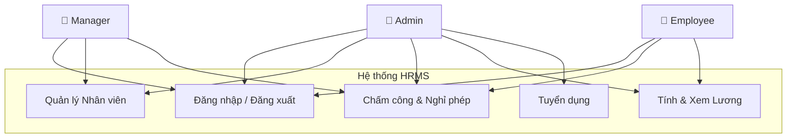
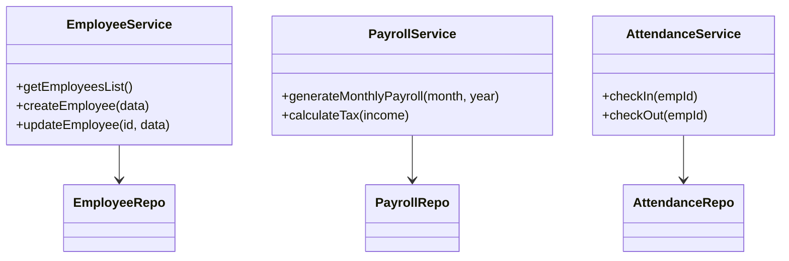
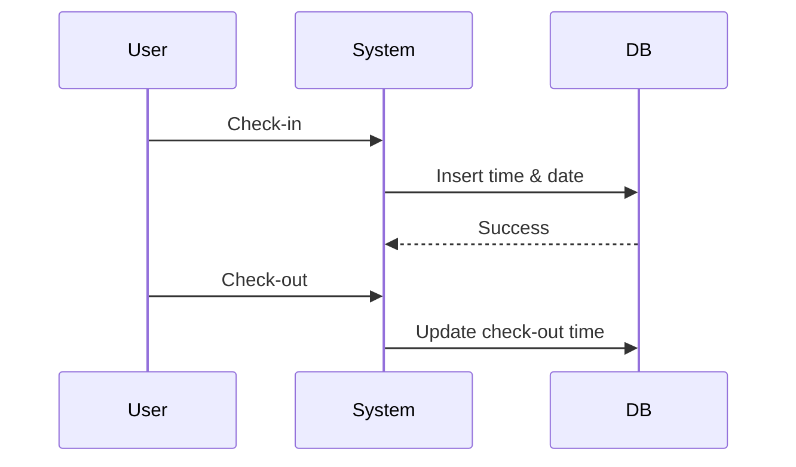

# 📘 Tài liệu Phân tích và Thiết kế Hệ thống HRMS

Tài liệu này mô tả chi tiết các sơ đồ phân tích, cấu trúc dữ liệu, kiến trúc hệ thống và các quy trình nghiệp vụ cốt lõi của **Hệ thống Quản lý Nhân sự (HRMS)**.

---

## 📑 Mục lục
1. [Tổng quan Hệ thống](#1-tổng-quan-hệ-thống)
2. [Phân tích Use Case](#2-phân-tích-use-case)
3. [Thiết kế Cơ sở dữ liệu (ERD)](#3-thiết-kế-cơ-sở-dữ-liệu-erd)
4. [Kiến trúc Hệ thống (Class Diagram)](#4-kiến-trúc-hệ-thống-class-diagram)
5. [Quy trình Nghiệp vụ (Sequence Diagrams)](#5-quy-trình-nghiệp-vụ-sequence-diagrams)
6. [Thành phần & Công nghệ](#6-thành-phần--công-nghệ)

---

## 1. Tổng quan Hệ thống
HRMS là giải pháp quản lý nhân sự toàn diện, giúp doanh nghiệp tự động hóa các quy trình từ tuyển dụng, quản lý hồ sơ nhân viên, chấm công, đến tính lương và báo cáo. Hệ thống phân quyền chặt chẽ theo 3 vai trò: Admin, Manager và Employee.

---

## 2. Phân tích Use Case

### 🎭 Danh sách Tác nhân (Actors)
*   **Admin (Quản trị viên)**: Có quyền cao nhất, quản lý toàn bộ cấu hình, nhân viên, bảng lương và tài sản.
*   **Manager (Quản lý)**: Quản lý nhân viên trong phòng ban của mình, duyệt các yêu cầu (nghỉ phép, làm thêm giờ, ứng lương).
*   **Employee (Nhân viên)**: Sử dụng hệ thống để chấm công, xem thông tin cá nhân, gửi các yêu cầu.
*   **Candidate (Ứng viên)**: Người dùng bên ngoài, xem tin tuyển dụng và nộp hồ sơ.

### 📦 Các Module Chức năng Chính (Use Cases)
1.  **Quản lý Hệ thống (System)**:
    *   Đăng nhập, Đăng xuất (Tất cả).
    *   Phân cấp quyền hạn (RBAC).
2.  **Quản lý Nhân sự (HR Core)**:
    *   CRUD Hồ sơ nhân viên (Admin/Manager).
    *   Quản lý Phòng ban, Hợp đồng lao động.
3.  **Quản lý Thời gian (Time Management)**:
    *   Chấm công hàng ngày (Check-in/Check-out).
    *   Gửi/Duyệt đơn xin nghỉ phép (Xem chi tiết: [Quy trình Xin nghỉ phép](LEAVE_PROCESS_ANALYSIS.md)).
    *   Đăng ký/Duyệt làm thêm giờ (OT).
4.  **Quản lý Lương thưởng (Payroll)**:
    *   Tính lương tự động (Based on Attendance, OT, Leave).
    *   Quản lý Ứng lương, Thưởng/Phạt.
    *   Xuất phiếu lương cá nhân.
5.  **Tuyển dụng (Recruitment)**:
    *   Đăng tin tuyển dụng.
    *   Nhận và quản lý hồ sơ ứng viên.

### Sơ đồ Use Case

---

## 3. Thiết kế Cơ sở dữ liệu (ERD)

Hệ thống sử dụng cơ sở dữ liệu quan hệ (PostgreSQL) với **18 bảng** chính.

### 🔑 Các Thực thể Quan trọng
1.  **`employees`**: Bảng trung tâm, lưu thông tin nhân viên, lương cơ bản, quota nghỉ phép. Liên kết 1-1 với `users` (để đăng nhập).
2.  **`departments`**: Phòng ban, chứa nhiều nhân viên.
3.  **`attendances`**: Lưu lịch sử chấm công từng ngày (check-in, check-out time).
4.  **`leave_requests`**: Đơn xin nghỉ phép, trạng thái (Pending/Approved/Rejected).
5.  **`payrolls` & `payslips`**: Lưu bảng lương hàng tháng và chi tiết phiếu lương của từng nhân viên.
6.  **`contracts`**: Thông tin hợp đồng lao động.
7.  **`job_openings` & `candidates`**: Phục vụ quy trình tuyển dụng.

### Mô hình Quan hệ (Snapshot)
*   **One-to-Many**: `departments` -> `employees`, `employees` -> `attendances`, `employees` -> `leave_requests`.
*   **Self-Reference**: Nhân viên duyệt yêu cầu cho nhân viên khác (Manager approved).

---

## 4. Kiến trúc Hệ thống (Class Diagram)

Hệ thống được xây dựng theo kiến trúc **3-Layer** (Presentation, Business Logic, Data Access) sử dụng **Next.js** và **TypeScript**.

### Các tầng kiến trúc
1.  **Presentation Layer (Client & Server Components)**:
    *   Các page trong thư mục `app/`: hiển thị UI, nhận input.
    *   Sử dụng UI Components (Shadcn/UI).
2.  **Business Logic Layer (Services)**:
    *   Thư mục `server/services/`.
    *   Chứa logic nghiệp vụ: tính lương, validate chấm công, kiểm tra quyền.
    *   Ví dụ: `EmployeeService`, `PayrollService`.
3.  **Data Access Layer (Repositories)**:
    *   Thư mục `server/repositories/`.
    *   Giao tiếp trực tiếp với Database qua Supabase Client.
    *   Ví dụ: `EmployeeRepo`, `AttendanceRepo`.

### Sơ đồ Lớp (Service Layer)

---

## 5. Quy trình Nghiệp vụ (Sequence Diagrams)

### 5.1. Quy trình Đăng nhập & Phân quyền
1.  Người dùng nhập email/pass.
2.  Hệ thống xác thực qua **Supabase Auth**.
3.  **Middleware** kiểm tra Role trong bảng DB.
4.  Điều hướng:
    *   **Admin/Manager** -> Dashboard.
    *   **Employee** -> Profile cá nhân.

### 5.2. Quy trình Chấm công (Timekeeping)
Quy trình giúp theo dõi giờ làm việc thực tế.
1.  Nhân viên login vào trang cá nhân.
2.  Nhấn nút **Check-in**: Hệ thống tạo bản ghi `attendances` với giờ hiện tại.
3.  Cuối ngày nhấn **Check-out**: Hệ thống cập nhật giờ về.
4.  Hệ thống tự động tính trạng thái (Đi muộn, Về sớm, Đủ công).

### 5.3. Quy trình Tính lương (Payroll Calculation)
Quy trình phức tạp nhất, diễn ra vào cuối tháng.
1.  HR chọn tháng/năm cần tính.
2.  `PayrollService` lấy danh sách nhân viên.
3.  Với mỗi nhân viên, hệ thống tổng hợp:
    *   Số công làm việc (từ bảng `attendances`).
    *   Số giờ làm thêm được duyệt (từ `overtime_requests`).
    *   Số ngày nghỉ có phép (từ `leave_requests`).
    *   Các khoản thưởng/phạt và ứng lương.
4.  Áp dụng công thức tính Thuế TNCN lũy tiến & BHXH.
5.  Lưu kết quả vào `payslips` và hiển thị bản nháp (Draft).
6.  HR rà soát và chốt lương (Mark as Paid).

### 5.4. Quy trình Tuyển dụng
1.  HR tạo tin tuyển dụng (`job_openings`).
2.  Ứng viên nộp hồ sơ, hệ thống tạo bản ghi `candidates`.
3.  HR cập nhật trạng thái ứng viên (Duyệt hồ sơ -> Phỏng vấn -> Offer).
4.  Nếu trúng tuyển, chuyển đổi thông tin Candidate -> Employee.

---

## 6. Thành phần & Công nghệ
*   **Frontend**: Next.js 16.x (App Router), React, Tailwind CSS, Shadcn UI.
*   **Backend**: Next.js Server Actions, TypeScript.
*   **Database**: Supabase (PostgreSQL), Row Level Security (RLS).
*   **Auth**: Supabase Auth (Email/Password).
*   **Deployment**: Vercel.

---
*Tài liệu được tự động tạo bởi trợ lý AI dựa trên mã nguồn dự án.*
